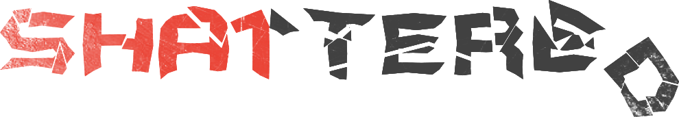
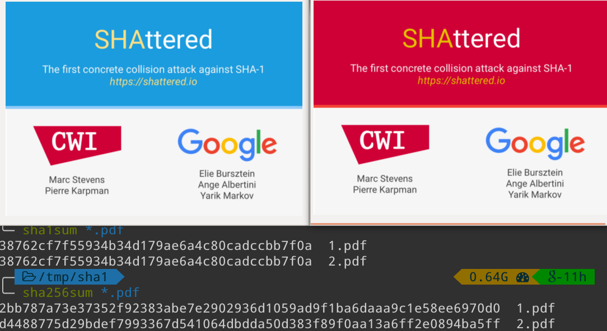

name: inverse
layout: true
class: center, middle, inverse
link: https://tikiki.github.io/forma-shattered

---

# SHAttered
### *COLLISION IMMINENTE DÉTECTÉE*

.shattered_logo_img[]

#### {{ link }}

---
layout: false

.left-column[
## SHAttered
]

.right-column[
Le 23 février, Google annonce qu'il a généré la première vraie collision SHA-1 de l'histoire.
]

--
count: false

 
 
 
 
.right-column[
Internet tremble.
]

--
count: false

 
 
 
 
.right-column[
Sauf que c'est quoi exactement SHA-1, en fait ?
]

---

.left-column[
## SHA-1
]

.right-column[
- SHA-1 veut dire **Secured Hash Algorithm 1**

- Développé en 1993 aux États-Unis -> SHA-0

- Amélioré en 1995 -> SHA-1

- SHA-1 est une fonction de hash cryptographique.
]

???

Fonctionnement : ça prend une donnée en entrée (très souvent un fichier, mais ça peut être un simple texte) et le transforme en une chaîne de caractères de longueur fixe.

--
count: false

.right-column-no-padding[
.crypto_hash_function_img[]
]

???

- Déterministe : même input => même hash
- Rapide à calculer
- Fonction à sens unique (si on donne un hash, il est impossible de retrouver le fichier d'origine, sauf à essayer tous les fichiers)
- Un petit changement dans l'entrée crée deux hash totalement différents
- Deux entrées différentes ne doivent pas donner le même hash

- Entrée = "message", sortie = "digest"

---
template: inverse

# Comment on pourrait s'en servir ?

---
layout: false

.left-column[
## Exemple de base
]

.right-column[
- Alice a trouvé un problème de maths très intéressant, et le pose à Bob.

- Bob a envie de réfléchir dessus, mais ne veut pas travailler pour rien. Il demande à Alice une preuve de sa solution.
]

--
count: false

.right-column-no-padding[
- Alice écrit sa solution dans son coin, en calcule le hash, et l'envoie à Bob.
]

--
count: false

.right-column-no-padding[
- 3 jours plus tard, Bob a trouvé une solution. Il va voir Alice, qui peut bien lui prouver qu'elle avait la solution avant en la lui exposant, et en montrant que le hash est le même.
]

---
template: inverse

# À quoi ça sert dans la vraie vie ?

---
layout: false

.left-column[
## À quoi ça sert ?
]

.right-column[
- Somme de contrôle de fichier (vérification d'un téléchargement, déduplication de fichiers)

- Hash de commit git (et mercurial ou SVN)

- Stockage de mots de passes (avec un salt)

- TLS/SSL (certificats)(mais plus utilisés depuis fin 2014)

- SSH

- PGP

Fun fact : le miroir SVN de Webkit est tout cassé, parce qu'ils ont voulu faire un test pour montrer que SVN ne gérait pas les collisions, ça a un peu trop bien marché ^^

Fun fact bis : git utilise SHA-1 pour les hash des objets (commits, tags, branches...), mais le risque d'une collision naturelle est _très_ faible. Si 5 millions de développeurs faisaient chacun un commit par seconde, les chances qu'une collision se produise avant que le soleil ne devienne une géante rouge sont de 50%.
]

---
template: inverse

# Attaques possibles

---
layout: false

.left-column[
## Attaques
]

.right-column[
- Rainbow tables (pour les algorithmes rapides, type MD5, NTLM)
]

--
count: false

.right-column-no-padding[
- SHAttered
]

---
count: false

.left-column[
## Attaques
]

.right-column[
- Rainbow tables (pour les algorithmes rapides, type MD5, NTLM)
]

.right-column-no-padding[
- SHAttered

  - 9.223.372.036.854.775.808 calculs de hash SHA1

  - 6.500 ans de calculs CPU

  - 110 ans de calculs GPU (110.000$ chez Amazon AWS)
]

---
count: false

.left-column[
## Attaques
]

.right-column[
- Rainbow tables (pour les algorithmes rapides, type MD5, NTLM)
]

.right-column-no-padding[
- SHAttered

  - 9.223.372.036.854.775.808 calculs de hash SHA1

  - 6.500 ans de calculs CPU

  - 110 ans de calculs GPU (110.000$ chez Amazon AWS)

  - 100.000x plus rapide que le bruteforce
]

---
count: false

.left-column[
## Attaques
]

.right-column[
- Rainbow tables (pour les algorithmes rapides, type MD5, NTLM)
]

.right-column-no-padding[
- SHAttered

  - 9.223.372.036.854.775.808 calculs de hash SHA1

  - 6.500 ans de calculs CPU

  - 110 ans de calculs GPU (110.000$ chez Amazon AWS)

  - 100.000x plus rapide que le bruteforce

.shattered_proof_img[]
]

???

L'attaque a été faire sur des fichiers PDF. Le format de fichier PDF est assez permissif, et on peut mettre plein de données insensées au milieu, elles ne seront pas interprétées. En revanche, elles serviront lors du calcul du hash. On peut donc forger un peu le fichier comme on le veut.

---

.left-column[
## Sources
]

.right-column[
- https://en.wikipedia.org/wiki/SHA-1

- https://en.wikipedia.org/wiki/Cryptographic_hash_function

- http://shattered.io/

- https://www.howtogeek.com/238705/what-is-sha-1-and-why-will-retiring-it-kick-thousands-off-the-internet/

- https://bugs.webkit.org/show_bug.cgi?id=168774&comment=c27#c27

- https://github.com/blog/2338-sha-1-collision-detection-on-github-com
]
---
template: inverse

# The end

### {{ link }}
