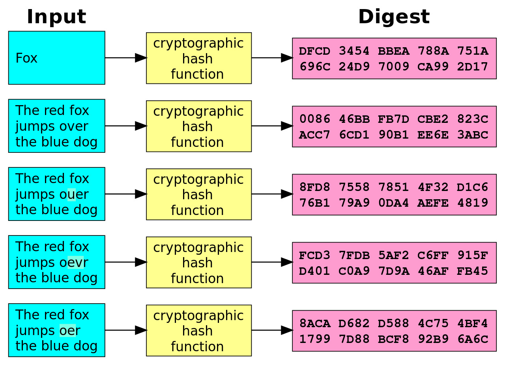

name: inverse
layout: true
class: center, middle, inverse
link: https://tikiki.github.io/forma-shattered

---

# SHAttered
### *COLLISION IMMINENTE DÉTECTÉE*

.shattered_logo_img[]

#### {{ link }}

---
layout: false

.left-column[
## SHAttered
]

.right-column[
Le 23 février, Google annonce qu'il a généré la première vraie collision SHA-1 de l'histoire.
]

--
count: false

 
 
 
 
.right-column[
Internet tremble.
]

--
count: false

 
 
 
 
.right-column[
Sauf que c'est quoi exactement SHA-1, en fait ?
]

---

.left-column[
## SHA-1
]

.right-column[
- SHA-1 veut dire **Secured Hash Algorithm 1**

- SHA-1 est une fonction de hash cryptographique.
]

???

Fonctionnement : ça prend une donnée en entrée (très souvent un fichier, mais ça peut être un simple flux binaire) et le transforme en une chaîne de caractères de longueur fixe.

--
count: false

.right-column-no-padding[
.crypto_hash_function_img[]
]

???

- Même input => même hash
- Rapide à calculer
- Fonction à sens unique (si on donne un hash, il est impossible de retrouver le fichier d'origine, sauf à essayer tous les fichiers)
- Un petit changement dans l'entrée crée deux hash totalement différents
- Deux entrées différentes ne doivent pas donner le même hash

---
template: inverse

# À quoi ça sert

---
layout: false

.left-column[
## À quoi ça sert ?
]

.right-column[
- Somme de contrôle de fichier (vérification d'un téléchargement)

- Hash de commit git (et mercurial)

- TLS/SSL

- SSH

- PGP

- 
]

---

.left-column[
## Sources
]

.right-column[
- https://en.wikipedia.org/wiki/SHA-1

- http://shattered.io/

- https://www.howtogeek.com/238705/what-is-sha-1-and-why-will-retiring-it-kick-thousands-off-the-internet/
]
---
template: inverse

# The end

### {{ link }}
